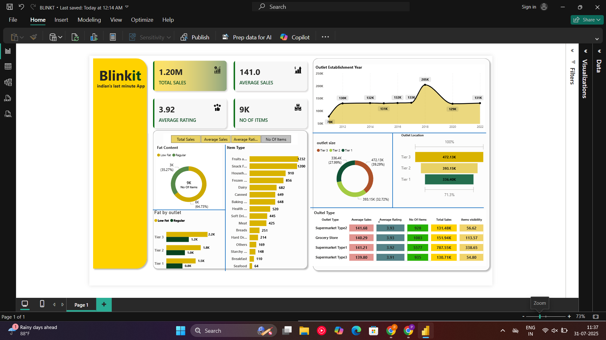

📊 Overview

The BLINKT Dashboard is a Power BI report designed to provide insights and analytics related to [insert business context, e.g., sales performance, customer behavior, operational efficiency]. It includes dynamic visuals, KPI indicators, and interactive slicers to facilitate data-driven decision-making.

🧩 Features

Interactive and dynamic dashboard views

Key performance indicators (KPIs)

Trend analysis over time

Filters and slicers for detailed drill-downs

User-friendly interface for non-technical users

📁 File

BLINKT.pbix – The main Power BI report file.

🚀 How to Use

Open the file using Microsoft Power BI Desktop.

Connect to your data source if prompted.

Navigate through the tabs to explore different insights.

Use slicers to filter views based on region, time period, or other parameters.

🛠️ Requirements

Microsoft Power BI Desktop (latest version recommended)

Access to any external data sources used (if applicable)

🧠 Insights

This dashboard enables users to:

Monitor and evaluate key metrics

Identify performance trends and anomalies

Make informed strategic decisions

## 📸 Dashboard Preview

